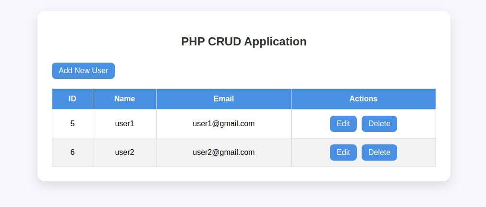
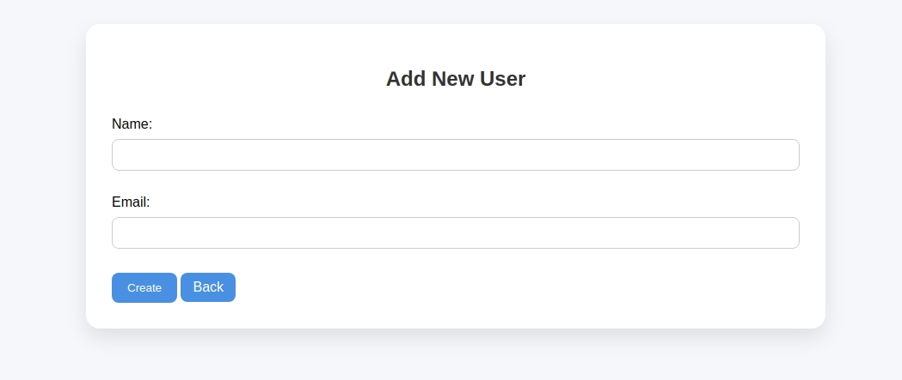
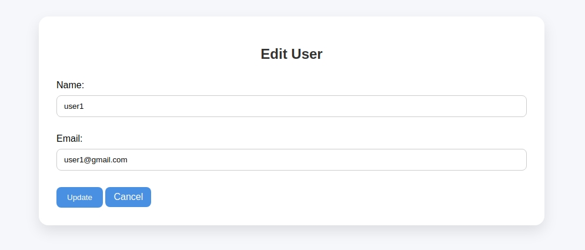

# ⚡️ User Management CRUD App

Welcome to the **User Management CRUD App** — a raw crud application for managing users.

---

## 🧩 Features

- ✅ Add User  
- 🛠️ Edit User  
- 🔄 Update User  
- 🗑️ Delete User  

---

## 💻 Tech Stack

> Customize this based on your stack. Here's a placeholder:

- 🧠 **Backend**: PHP.  
- 🎨 **Frontend**: HTML / CSS.  
- 🛢️ **Database**: MySQL.

---

## 📸 UI Preview

---

## ✍️ Author

Made with 💻 by [Md Nayeem Ahmed]((https://github.com/0xNeon2/))  
Feel free to connect or fork the repo if you vibe with it.

